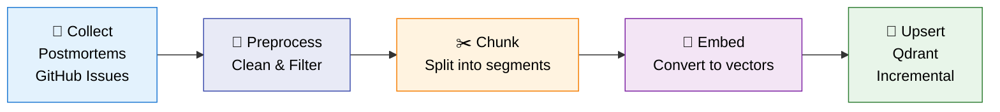
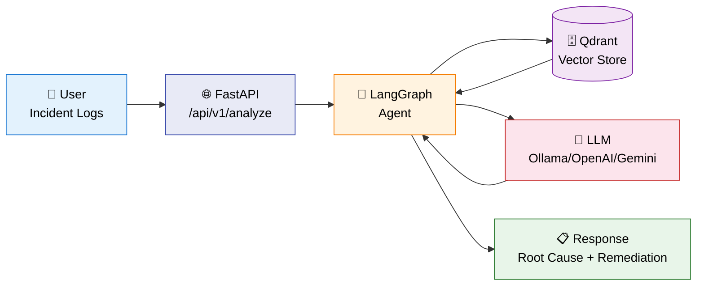

# Ariadne – Architecture Document

> *Ariadne’s Thread: Guiding you from symptoms to root cause*

---

## 1. Overview

**Ariadne** is an LLM-based system designed to guide users from their application's problematic logs to identifying the root cause. It uses an agent-based architecture (orchestrated with Langraph) and a RAG pipeline to provide accurate and contextual responses.
Note: The tool is designed to run 100% locally.

### Main Stack
| Layer | Technology |
|---|---|
| Backend | Python 3.11 |
| LLM Provider | Ollama (can be switched to OpenAI or Gemini) |
| Vector Store | Qdrant |
| Agents Orchestration | Langraph |
| CI/CD | GitHub Actions to Fly.io |

---

## 2. System Architecture

Ariadne operates in two modes: an **offline indexing pipeline** that processes incident knowledge into a vector store, and an **online query pipeline** where a LangGraph agent retrieves and reasons over that knowledge in real time.

---

### 2.1 Offline Indexing Pipeline

> **Batch process.** This pipeline runs offline and must complete before the system can serve any queries. It is orchestrated with **DVC** and triggered manually or on data updates — not on every user request.



**DVC stages:** `collect → preprocess → chunk → index_{provider} → evaluate → diagnose`

| Stage | Strategy | Detail |
|---|---|---|
| Preprocessing | Rule-based filtering (length, code ratio, age) + two-pass deduplication | [→ details](#preprocessing--cleaning) |
| Chunking | RecursiveCharacterTextSplitter — 3 configurable size presets | [→ details](#chunking-strategy) |
| Embedding | Pluggable provider via `EMBEDDING_PROVIDER` env var | [→ details](#embedding-models) |
| Vector Index | HNSW in Qdrant, cosine distance, rich metadata payload per vector | [→ details](#vector-index-qdrant) |
| Insertion | Incremental batch upserts — skips already-indexed documents by ID | [→ details](#incremental-insertion) |

---

### 2.2 Online Query Pipeline

When a user submits incident logs, the system processes them through the LangGraph agent in real time.



| Strategy | Approach | Detail |
|---|---|---|
| Retrieval | Hybrid: vector similarity search + keyword overlap scoring | [→ details](#retrieval-strategy) |
| Query Understanding | Incident typed and classified before retrieval (type + severity) | [→ details](#query-understanding) |
| Re-ranking & Filtering | Hybrid score: cosine × 0.65 + keyword overlap × 0.35 | [→ details](#re-ranking--filtering) |
| Generation | LLM synthesizes retrieved context into a structured root-cause analysis | [→ details](#generation-strategy) |
| Grounding & Guardrails | Confidence threshold (0.7) gates output; agent retries if below | [→ details](#grounding--guardrails) |
| Fallbacks & Recovery | Automatic retrieval retry (up to 2 attempts); graceful degradation | [→ details](#fallbacks--recovery) |
| Observability | LangSmith request tracing + RAGAS offline evaluation | [→ details](#observability--evaluation) |

---

### 2.3 LangGraph Agent Flow

The agent is a **stateful directed graph**. Each node performs a discrete reasoning step; the conditional edge after `analyze` enables automatic retry when LLM confidence is below threshold.


> **Retry logic:** if the LLM's confidence score is below `0.7` and fewer than 2 retrieval attempts have been made, the graph loops back to `retrieve` with the same query — allowing the agent to self-correct before producing its final answer.

---

### Key Components

| Component | Role |
|---|---|
| **FastAPI** | REST layer — receives incident logs, returns structured JSON analysis |
| **LangGraph Agent** | Orchestrates the `classify → retrieve → analyze` loop with retry |
| **Classifier** | LLM call to identify incident type and severity from raw logs |
| **Retriever** | Hybrid search (cosine × 0.65 + keyword overlap × 0.35) against Qdrant |
| **Analyzer** | LLM call that synthesizes retrieved context into a root-cause explanation |
| **Qdrant** | Vector store holding embedded postmortems and GitHub issues |
| **LLM** | Ollama (local) / OpenAI / Gemini — swappable via `LLM_PROVIDER` env var |

---

## 3. Agentes

### Agente Principal: [nombre]
- **Responsabilidad**: 
- **Herramientas disponibles**: 
- **Estrategia de prompting**: 
- **Flujo de decisión**: 

### [Otros agentes si aplica]

---

## 4. Pipeline RAG (Retrieval-Augmented Generation)

- **Fuente de datos**: 
- **Chunking strategy**: 
- **Modelo de embeddings**: 
- **Vector Store**: 
- **Estrategia de retrieval**: 

---

## 5. Evaluación

- **Framework de evaluación**: 
- **Métricas clave**: 
- **Dataset de evaluación**: 
- **Resultados baseline**: 

---

## 6. Monitoreo

- **Health check**: `GET /health`
- **Ready check**: `GET /ready`
- **Logging**: 
- **Alertas**: 

---

## 7. CI/CD Pipeline

```
push/PR → [test] → (solo main) → [deploy-backend] → [smoke-test]
```

1. **test**: Corre `pytest tests/unit` con `VECTOR_STORE=none` (sin dependencias externas)
2. **deploy-backend**: `flyctl deploy` desde `infra/fly.toml`
3. **smoke-test**: Verifica `/health` y `/ready` post-deploy

---

## 8. Decisiones Arquitectónicas

### ADR-001: [Título de la decisión]
- **Contexto**: 
- **Decisión**: 
- **Consecuencias**: 

### ADR-002: VECTOR_STORE=none en tests unitarios
- **Contexto**: Los tests unitarios no deben depender de servicios externos
- **Decisión**: Se usa variable de entorno `VECTOR_STORE=none` para mockear el vector store
- **Consecuencias**: Tests rápidos y confiables en CI

---

## 9. Estructura del Proyecto

```
ariadne/
├── .github/workflows/
│   └── deploy.yml
├── infra/
│   └── fly.toml
├── tests/
│   └── unit/
├── requirements.txt
└── ARCHITECTURE.md
```

---

## 10. Historia y Evolución

### Semana 1 – [fecha]
- 

### Semana 2 – [fecha]
- 

---

## 11. Pendientes / Ideas Futuras

- [ ] 
- [ ] 

---

## A. Implementation Reference

> Detailed implementation notes for the strategies referenced in [Section 2 — System Architecture](#2-system-architecture).

---

### A.1 Indexing Pipeline

#### Preprocessing & Cleaning

Documents are filtered before chunking using the following rules (all must pass):

| Filter | Rule |
|---|---|
| Min length | 80 characters |
| Max length | 20,000 characters |
| Code ratio | Rejected if > 70% of content is code |
| Age | Configurable `max_age_days` (disabled by default) |

Surviving documents go through **two-pass deduplication**: exact (SHA-256 hash of normalized text) then semantic (Jaccard token overlap ≥ 0.85).

---

#### Chunking Strategy

Splitting is done with **RecursiveCharacterTextSplitter** and three presets:

| Preset | Chunk Size | Overlap |
|---|---|---|
| `small` | 300 tokens | 50 tokens |
| `medium` | 500 tokens | 75 tokens |
| `large` | 800 tokens | 120 tokens |

Chunks shorter than `1.5 × overlap` are discarded. Each chunk gets a deterministic ID (`{parent_id}-chunk-{i}-of-{total}`) and inherits the parent document's metadata.

---

#### Embedding Models

Embedding is **pluggable** via the `EMBEDDING_PROVIDER` environment variable. Switching providers requires a full reindex — the system enforces this with a version guard stored in the collection payload.

| Provider | Model | Dimensions |
|---|---|---|
| `openai` | `text-embedding-3-small` | 1536 |
| `ollama` | `nomic-embed-text:latest` | 768 |
| `gemini` | `text-embedding-004` | 768 |

Embeddings are computed in batches of 32. The collection name includes a provider suffix (e.g., `incident_knowledge_openai`) to prevent silent model mismatches across redeploys.

---

#### Vector Index (Qdrant)

| Parameter | Value |
|---|---|
| Distance metric | Cosine similarity |
| Index type | HNSW (Hierarchical Navigable Small World) |
| HNSW `m` | 16 |
| HNSW `ef_construct` | 200 |
| Payload indices | `source`, `severity`, `service`, `embedding_model` |
| Upsert batch size | 200 points per request |

Each vector carries a full metadata payload — including `id`, `title`, `content`, `source`, `severity`, `service`, `tags`, `chunk_index`, `chunk_total`, `token_count`, and `embedding_model` — returned alongside the score at query time.

---

#### Incremental Insertion

The pipeline runs in **incremental mode** by default: it queries Qdrant for existing point IDs (deterministic `UUID5(collection_name:doc_id)`) and skips documents already present. Only new documents are embedded and upserted.

> ⚠️ Deduplication is **ID-based**, not content-based. If a document's content changes but its ID stays the same, the old version persists silently. Use `force_reindex=True` to trigger a full rebuild.

---

#### DVC Pipeline Stages

| Stage | Input | Output |
|---|---|---|
| `collect` | External APIs (GitHub, postmortems) | `raw_*.json` |
| `preprocess` | `raw_*.json` | `clean_docs.json` + preprocess report |
| `chunk` | `clean_docs.json` | `chunks_medium.json` |
| `index_{provider}` | `chunks_medium.json` | Qdrant collection + `index_metrics.json` |
| `evaluate` | Qdrant + eval queries | `pipeline_report.json` |
| `diagnose` | `pipeline_report.json` | `pipeline_diagnosis.json` |

---

### A.2 Query Pipeline

#### Retrieval Strategy

Retrieval uses a **hybrid scoring** approach combining vector similarity with lexical overlap:

```
final_score = cosine_similarity × 0.65 + keyword_overlap × 0.35
```

- **Vector search**: top-8 candidates retrieved from Qdrant by cosine similarity
- **Keyword overlap**: token-based intersection between query and document (stopwords and tokens < 3 chars filtered out)
- Final **top-3** results are passed to the analyzer

---

#### Query Understanding

Before retrieval, the **Classify** node uses an LLM call to extract structured information from the raw incident logs:

- **Incident type** (e.g., `database`, `network`, `memory`, `auth`)
- **Severity** (e.g., `critical`, `high`, `medium`)

This classification context is attached to the retrieval query to improve result relevance.

---

#### Re-ranking & Filtering

After vector retrieval, results are re-ranked in-process using the hybrid score formula above — no external re-ranker model.

- `candidate_limit` (default: 8) — candidates fetched from Qdrant before rescoring
- `search_limit` (default: 3) — top results passed to the analyzer after rescoring

---

#### Generation Strategy

The **Analyze** node passes retrieved documents and a structured prompt to the LLM. The model is instructed to:

1. Identify the likely root cause from the provided context
2. Explain the reasoning
3. Suggest remediation steps
4. Return a **confidence score** (0.0 – 1.0) reflecting certainty

The output is parsed into a structured `AnalysisOutput` object used by the retry gate and response builder.

---

#### Grounding & Guardrails

A **confidence-gated output** pattern ensures quality:

- `confidence ≥ 0.7` → output accepted, response built
- `confidence < 0.7` AND `retrieval_attempts < 2` → agent retries retrieval
- The LLM is prompted to ground its answer strictly in the retrieved documents and to explicitly acknowledge insufficient context

---

#### Fallbacks & Recovery

| Condition | Behavior |
|---|---|
| Low confidence, first attempt | Retry retrieval with the same query |
| Low confidence, second attempt | Return best-effort answer with available context |
| Retrieval returns 0 documents | Analyzer receives empty context; LLM signals low confidence |
| Qdrant unavailable | Exception propagated to API layer; HTTP 503 returned |

---

#### Observability & Evaluation

**LangSmith** (online tracing):
- Every `run_graph()` call is traced when `LANGSMITH_API_KEY` is set
- Traces include LLM inputs/outputs, token counts, node timings, and provider metadata
- Tags: `ariadne`, `{mode}`, `llm:{provider}`, `emb:{provider}`

**RAGAS** (offline evaluation):
- Evaluation dataset: `data/eval_queries.json`
- Metrics: answer relevancy, faithfulness, context recall, context precision
- Results stored in `evals/results/` with timestamped JSON files
- A/B testing supported across provider configurations