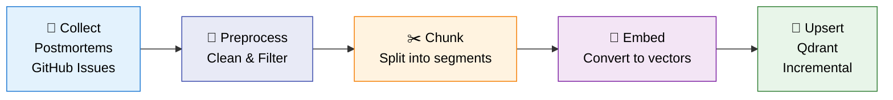
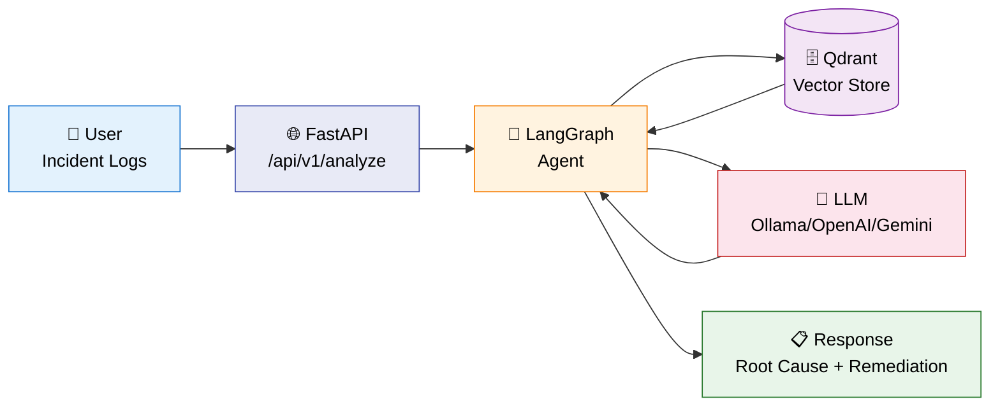
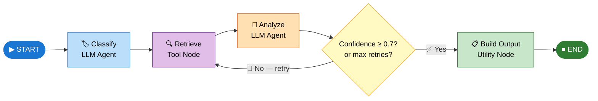

# Ariadne – Architecture Document

> *Ariadne’s Thread: Guiding you from symptoms to root cause*

---

## 1. Overview

**Ariadne** is an LLM-based system designed to guide users from their application's problematic logs to identifying the root cause. It uses an agent-based architecture (orchestrated with Langraph) and a RAG pipeline to provide accurate and contextual responses.
Note: The tool is designed to run 100% locally.

### Main Stack
| Layer | Technology |
|---|---|
| Backend | Python 3.11 |
| LLM Provider | Ollama (can be switched to OpenAI or Gemini) |
| Vector Store | Qdrant |
| Agents Orchestration | Langraph |
| CI/CD | GitHub Actions to Fly.io |

---

## 2. System Architecture

Ariadne operates in two modes: an **offline indexing pipeline** that processes incident knowledge into a vector store, and an **online query pipeline** where a LangGraph agent retrieves and reasons over that knowledge in real time.

---

### 2.1 Offline Indexing Pipeline

> **Batch process.** This pipeline runs offline and must complete before the system can serve any queries. It is orchestrated with **DVC** and triggered manually or on data updates.



**DVC stages:** `collect → preprocess → chunk → index_{provider} → evaluate → diagnose`

| Stage | Strategy | Detail |
|---|---|---|
| Collect | Fetch data from external sources — GitHub Issues, internal postmortems — via dedicated scrapers | [→ details](#dvc-pipeline-stages) |
| Preprocessing | Rule-based filtering (length, code ratio, age) + two-pass deduplication | [→ details](#preprocessing--cleaning) |
| Chunking | RecursiveCharacterTextSplitter — 3 configurable size presets | [→ details](#chunking-strategy) |
| Embedding | Pluggable provider via `EMBEDDING_PROVIDER` env var | [→ details](#embedding-models) |
| Vector Index | HNSW in Qdrant, cosine distance, rich metadata payload per vector | [→ details](#vector-index-qdrant) |
| Insertion | Incremental batch upserts — skips already-indexed documents by ID | [→ details](#incremental-insertion) |

---

### 2.2 Online Query Pipeline

When a user submits incident logs, the system processes them through the LangGraph agent in real time.



| Strategy | Approach | Detail |
|---|---|---|
| Retrieval | Hybrid: vector similarity search + keyword overlap scoring | [→ details](#retrieval-strategy) |
| Query Understanding | Incident typed and classified before retrieval (type + severity) | [→ details](#query-understanding) |
| Re-ranking & Filtering | Hybrid score: cosine × 0.65 + keyword overlap × 0.35 | [→ details](#re-ranking--filtering) |
| Generation | LLM synthesizes retrieved context into a structured root-cause analysis | [→ details](#generation-strategy) |
| Grounding & Guardrails | Confidence threshold (0.7) gates output; agent retries if below | [→ details](#grounding--guardrails) |
| Fallbacks & Recovery | Automatic retrieval retry (up to 2 attempts); graceful degradation | [→ details](#fallbacks--recovery) |
| Observability | LangSmith request tracing + RAGAS offline evaluation | [→ details](#observability--evaluation) |

---

### 2.3 LangGraph Agent Flow

Ariadne's reasoning is implemented as a **stateful directed graph** using LangGraph. All nodes share a single `IncidentState` object that accumulates results as the graph progresses. A conditional edge after `analyze` enables automatic self-correction via retry.


#### Graph Topology



| Node | Type | What it does | Detail |
|---|---|---|---|
| **Classify** | LLM Agent | Reads raw logs, infers incident type and severity | [→ Section 3.1](#31-classifier) |
| **Retrieve** | Tool Node | Hybrid vector + keyword search against Qdrant | [→ details](#retrieval-strategy) |
| **Analyze** | LLM Agent | Synthesizes retrieved context into a root-cause diagnosis with a confidence score | [→ Section 3.2](#32-analyzer) |
| **Build Output** | Utility Node | Assembles the structured final response from classification + analysis | — |
| **should_retry** | Conditional Edge | Routes to `retrieve` if confidence < 0.7 and attempts < 2; otherwise to `build_output` | — |

> **Retry logic:** if the LLM's confidence score is below `0.7` and fewer than 2 retrieval attempts have been made, the graph loops back to `retrieve` — allowing the agent to self-correct before producing its final answer.

---

## 3. Agents

In Ariadne, "agents" are the **LLM-powered nodes** inside the LangGraph graph. Each one performs a single, focused reasoning step and writes structured output back to the shared state. The `retrieve` step is intentionally **not** LLM-powered — it is a deterministic hybrid search function.

---

### 3.1 Classifier

The first reasoning step. Reads raw incident logs and determines what kind of incident is being reported.

| Property | Value |
|---|---|
| **Input** | Raw incident logs (`state.logs`) |
| **Output** | `incident_type`, `classification_confidence` |
| **Prompting strategy** | Zero-shot classification — given a fixed list of incident categories, the model picks the best match and returns a confidence score (0.0 – 1.0) |
| **Purpose** | Focus downstream retrieval on the right class of documents; avoid retrieving irrelevant knowledge |

---

### 3.2 Analyzer

The core reasoning step. Receives retrieved documents and synthesizes them into a structured diagnosis.

| Property | Value |
|---|---|
| **Input** | Raw logs + retrieved context documents (`state.context`) |
| **Output** | `AnalysisOutput` — root cause, reasoning, remediation steps, confidence score |
| **Prompting strategy** | Grounded reasoning — the model derives its answer strictly from the provided context, explains its reasoning step by step, suggests actionable remediation, and returns a confidence score. If context is insufficient, it must acknowledge this explicitly. |
| **Purpose** | Produce trustworthy, grounded root-cause diagnoses; the confidence score drives the retry gate |

---

## 4. RAG Pipeline

RAG (Retrieval-Augmented Generation) is the technique that grounds Ariadne's answers in real incident history rather than unconstrained LLM generation. It connects the two pipelines described in Section 2.

```
[Offline]  Collect → Preprocess → Chunk → Embed → Qdrant
                                                      │
[Online]   User → Classify → Retrieve ───────────────┘
                              │
                           Analyze → Response
```

### Data Sources

| Source | Content | Collection method |
|---|---|---|
| **Postmortems** | Internal incident reports with root cause and timeline | DVC `collect` stage |
| **GitHub Issues** | External bug reports and operational incidents | GitHub API via DVC |

### Key Design Choices

- **Classify before retrieve:** incident type and severity are extracted first, focusing retrieval on the right class of documents rather than doing a generic search
- **Hybrid retrieval over pure vector search:** combines semantic similarity (cosine) with lexical overlap (keyword tokens) to handle cases where exact terms matter
- **Rich payload per vector:** each document carries full metadata (source, severity, service, tags) so the LLM can reason about context provenance
- **Incremental indexing:** new documents are upserted without requiring a full corpus reindex

For full implementation details see [Appendix A — Implementation Reference](#a-implementation-reference).

---

## 5. Evaluation

Ariadne uses **RAGAS** as its offline evaluation framework to measure RAG quality across a representative set of queries.

### Metrics

| Metric | What it measures |
|---|---|
| **Answer Relevancy** | How well the generated answer addresses the question |
| **Faithfulness** | Whether the answer is grounded in the retrieved context (no hallucination) |
| **Context Recall** | How much of the ground-truth answer is covered by the retrieved documents |
| **Context Precision** | What fraction of retrieved documents are actually relevant to the query |

### Evaluation Dataset

- **Location:** `data/eval_queries.json`
- **Format:** list of `{ question, ground_truth }` pairs covering representative incident scenarios across different types and severities

### Results & A/B Testing

Evaluation runs are stored in `evals/results/` as timestamped JSON files (e.g., `ab_test_20260325T...Z.json`). The latest run is always available at `evals/results/latest.json`. A/B testing across different LLM and embedding provider combinations is supported — each run records the provider configuration used.

---

## 6. Observability

### Request Tracing — LangSmith

When `LANGSMITH_API_KEY` is configured, every `run_graph()` call is automatically traced. Traces capture:

- Full LLM prompt and completion at each node
- Token counts (prompt + completion) per call and cumulative total
- Per-node execution time (`node_timings`)
- Run metadata: `run_id`, `mode`, `llm_provider`, `embedding_provider`
- Tags: `ariadne`, `{mode}`, `llm:{provider}`, `emb:{provider}`

This makes it easy to compare providers, debug retrieval quality, and inspect retry behavior directly in the LangSmith UI.

### Health & Readiness Endpoints

| Endpoint | Purpose |
|---|---|
| `GET /health` | Liveness check — returns `200` if the process is running |
| `GET /ready` | Readiness check — confirms the vector store and LLM provider are reachable |

### Structured Logging

Each node emits a structured log line with its key output fields, for example:

```
[classify] incident_type=database confidence=0.92 duration=1.23s
[retrieve] attempt=1 docs=3 duration=0.45s
[analyze] confidence=0.85 duration=3.12s
```

Logging is configured in `ariadne/core/logging_config.py` and works without LangSmith for local development.

---

## 7. CI/CD & Deployment

```
push/PR → [test] → (solo main) → [deploy-backend] → [smoke-test]
```

1. **test**: Runs `pytest tests/unit` with `VECTOR_STORE=none` (no external dependencies required)
2. **deploy-backend**: `flyctl deploy` from `infra/fly.toml`
3. **smoke-test**: Verifies `/health` and `/ready` endpoints after deploy

### Deployment Target — Fly.io

The backend is containerised via `infra/Dockerfile` and deployed to **Fly.io** as a single machine. Configuration lives in `infra/fly.toml`.

| Setting | Value |
|---|---|
| Region | `iad` (US East) |
| Runtime | Docker (Python 3.11) |
| Health check | `GET /health` |
| Secrets | `QDRANT_URL`, `LLM_PROVIDER`, `LANGSMITH_API_KEY` set via `fly secrets` |

The Qdrant vector store runs as a separate service and is accessed over the network via `QDRANT_URL`. No stateful volumes are mounted on the app machine itself.

---

## 8. Architectural Decisions

### ADR-001: LangGraph for agent orchestration
- **Context**: The system needs a flexible, debuggable way to orchestrate multi-step LLM reasoning with conditional logic and retry
- **Decision**: LangGraph was chosen for its native support for stateful graphs, conditional edges, and built-in integration with LangSmith tracing
- **Consequences**: Clean separation of reasoning steps; self-correction via retry; full execution traces available in LangSmith

### ADR-002: `VECTOR_STORE=none` in unit tests
- **Context**: Unit tests must not depend on external services (Qdrant, LLM providers)
- **Decision**: The `VECTOR_STORE=none` environment variable is used to mock the vector store during test runs
- **Consequences**: Fast, reliable CI tests with no external dependencies

---

## 9. Project Structure

```
ariadne/
├── .github/workflows/
│   └── deploy.yml
├── infra/
│   └── fly.toml
├── tests/
│   └── unit/
├── requirements.txt
└── ARCHITECTURE.md
```

---

## 10. Lessons Learned

During the development of the Ariadne project, an incident diagnosis system based on RAG and LLM agents, I gained practical knowledge in key tools for monitoring, evaluation, and data pipeline management. Below, I summarize my main learnings:

#### LangSmith
- **Project Integration**: Learned to incorporate LangSmith into Python applications to track agent and LLM executions, configuring API keys and enabling automatic traces in LangGraph flows.
- **Trace Analysis**: Developed skills to inspect detailed traces, including prompts, completions, execution times, and metadata, facilitating debugging of complex reasonings.
- **Experiment Uploads**: Experimented with uploading and comparing experiments on the platform, tagging runs by providers (LLM/embedding) for comparative analysis.
- **Metric Visualization**: Used dashboards to monitor token usage, latencies, and error patterns, improving production observability.

#### RAGAS
- **Basic Evaluation Metrics**: Implemented offline evaluations to measure RAG quality, including context recall, context precision, and answer relevancy, using synthetic datasets.
- **Answer Relevancy and Faithfulness**: Integrated specific metrics like answer relevancy (response relevance) and faithfulness (context fidelity), ensuring generated responses are well-grounded.
- **Natural Language Inference Models**: Explored the use of NLI models to evaluate response coherence and truthfulness, applying them in evaluation pipelines to detect hallucinations.

#### DVC
- **Pipeline Flow Definition**: Designed modular pipelines with stages (collect, preprocess, etc.), defining dependencies and parameters in YAML files to automate data processes.
- **Dataset Versioning**: Learned to version datasets and models with DVC, tracking changes in Git repositories and facilitating experiment reproducibility.
- **Stage Execution**: Executed individual or complete stages via CLI, handling incremental and forced re-runs to optimize processing times.
- **CLI Workflow**: Mastered key commands like `dvc run`, `dvc repro`, and `dvc push/pull`, integrating them into CI/CD workflows for efficient deployments.

---

## A. Implementation Reference

> Detailed implementation notes for the strategies referenced in [Section 2 — System Architecture](#2-system-architecture).

---

### A.1 Indexing Pipeline

#### Preprocessing & Cleaning

Documents are filtered before chunking using the following rules (all must pass):

| Filter | Rule |
|---|---|
| Min length | 80 characters |
| Max length | 20,000 characters |
| Code ratio | Rejected if > 70% of content is code |
| Age | Configurable `max_age_days` (disabled by default) |

Surviving documents go through **two-pass deduplication**: exact (SHA-256 hash of normalized text) then semantic (Jaccard token overlap ≥ 0.85).

---

#### Chunking Strategy

Splitting is done with **RecursiveCharacterTextSplitter** and three presets:

| Preset | Chunk Size | Overlap |
|---|---|---|
| `small` | 300 tokens | 50 tokens |
| `medium` | 500 tokens | 75 tokens |
| `large` | 800 tokens | 120 tokens |

Chunks shorter than `1.5 × overlap` are discarded. Each chunk gets a deterministic ID (`{parent_id}-chunk-{i}-of-{total}`) and inherits the parent document's metadata.

---

#### Embedding Models

Embedding is **pluggable** via the `EMBEDDING_PROVIDER` environment variable. Switching providers requires a full reindex — the system enforces this with a version guard stored in the collection payload.

| Provider | Model | Dimensions |
|---|---|---|
| `openai` | `text-embedding-3-small` | 1536 |
| `ollama` | `nomic-embed-text:latest` | 768 |
| `gemini` | `text-embedding-004` | 768 |

Embeddings are computed in batches of 32. The collection name includes a provider suffix (e.g., `incident_knowledge_openai`) to prevent silent model mismatches across redeploys.

---

#### Vector Index (Qdrant)

| Parameter | Value |
|---|---|
| Distance metric | Cosine similarity |
| Index type | HNSW (Hierarchical Navigable Small World) |
| HNSW `m` | 16 |
| HNSW `ef_construct` | 200 |
| Payload indices | `source`, `severity`, `service`, `embedding_model` |
| Upsert batch size | 200 points per request |

Each vector carries a full metadata payload — including `id`, `title`, `content`, `source`, `severity`, `service`, `tags`, `chunk_index`, `chunk_total`, `token_count`, and `embedding_model` — returned alongside the score at query time.

---

#### Incremental Insertion

The pipeline runs in **incremental mode** by default: it queries Qdrant for existing point IDs (deterministic `UUID5(collection_name:doc_id)`) and skips documents already present. Only new documents are embedded and upserted.

> ⚠️ Deduplication is **ID-based**, not content-based. If a document's content changes but its ID stays the same, the old version persists silently. Use `force_reindex=True` to trigger a full rebuild.

---

#### DVC Pipeline Stages

| Stage | Input | Output |
|---|---|---|
| `collect` | External APIs (GitHub, postmortems) | `raw_*.json` |
| `preprocess` | `raw_*.json` | `clean_docs.json` + preprocess report |
| `chunk` | `clean_docs.json` | `chunks_medium.json` |
| `index_{provider}` | `chunks_medium.json` | Qdrant collection + `index_metrics.json` |
| `evaluate` | Qdrant + eval queries | `pipeline_report.json` |
| `diagnose` | `pipeline_report.json` | `pipeline_diagnosis.json` |

---

### A.2 Query Pipeline

#### Retrieval Strategy

Retrieval uses a **hybrid scoring** approach combining vector similarity with lexical overlap:

```
final_score = cosine_similarity × 0.65 + keyword_overlap × 0.35
```

- **Vector search**: top-8 candidates retrieved from Qdrant by cosine similarity
- **Keyword overlap**: token-based intersection between query and document (stopwords and tokens < 3 chars filtered out)
- Final **top-3** results are passed to the analyzer

---

#### Query Understanding

Before retrieval, the **Classify** node uses an LLM call to extract structured information from the raw incident logs:

- **Incident type** (e.g., `database`, `network`, `memory`, `auth`)
- **Severity** (e.g., `critical`, `high`, `medium`)

This classification context is attached to the retrieval query to improve result relevance.

---

#### Re-ranking & Filtering

After vector retrieval, results are re-ranked in-process using the hybrid score formula above — no external re-ranker model.

- `candidate_limit` (default: 8) — candidates fetched from Qdrant before rescoring
- `search_limit` (default: 3) — top results passed to the analyzer after rescoring

---

#### Generation Strategy

The **Analyze** node passes retrieved documents and a structured prompt to the LLM. The model is instructed to:

1. Identify the likely root cause from the provided context
2. Explain the reasoning
3. Suggest remediation steps
4. Return a **confidence score** (0.0 – 1.0) reflecting certainty

The output is parsed into a structured `AnalysisOutput` object used by the retry gate and response builder.

---

#### Grounding & Guardrails

A **confidence-gated output** pattern ensures quality:

- `confidence ≥ 0.7` → output accepted, response built
- `confidence < 0.7` AND `retrieval_attempts < 2` → agent retries retrieval
- The LLM is prompted to ground its answer strictly in the retrieved documents and to explicitly acknowledge insufficient context

---

#### Fallbacks & Recovery

| Condition | Behavior |
|---|---|
| Low confidence, first attempt | Retry retrieval with the same query |
| Low confidence, second attempt | Return best-effort answer with available context |
| Retrieval returns 0 documents | Analyzer receives empty context; LLM signals low confidence |
| Qdrant unavailable | Exception propagated to API layer; HTTP 503 returned |

> For observability (LangSmith) and evaluation (RAGAS) details, see [Section 5 — Evaluation](#5-evaluation) and [Section 6 — Observability](#6-observability).