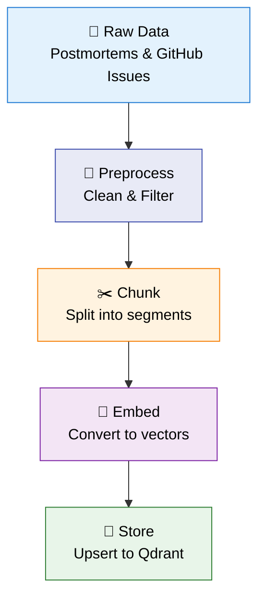
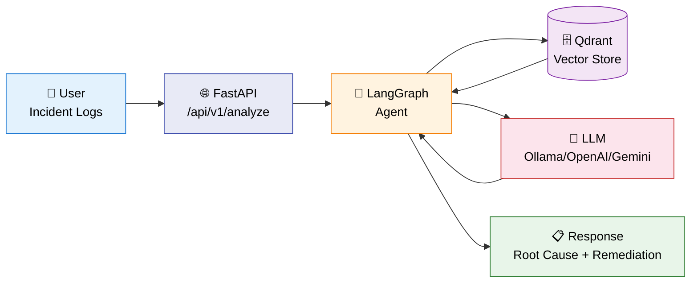
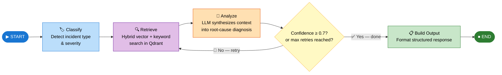

# Ariadne – Architecture Document

> *Ariadne’s Thread: Guiding you from symptoms to root cause*

---

## 1. Overview

**Ariadne** is an LLM-based system designed to guide users from their application's problematic logs to identifying the root cause. It uses an agent-based architecture (orchestrated with Langraph) and a RAG pipeline to provide accurate and contextual responses.
Note: The tool is designed to run 100% locally.

### Main Stack
| Layer | Technology |
|---|---|
| Backend | Python 3.11 |
| LLM Provider | Ollama (can be switched to OpenAI or Gemini) |
| Vector Store | Qdrant |
| Agents Orchestration | Langraph |
| CI/CD | GitHub Actions to Fly.io |

---

## 2. System Architecture

Ariadne operates in two modes: an **offline indexing pipeline** that processes incident knowledge into a vector store, and an **online query pipeline** where a LangGraph agent retrieves and reasons over that knowledge in real time.

---

### 2.1 Offline Indexing Pipeline

The indexing pipeline runs offline via DVC to populate Qdrant with embedded incident knowledge. This happens before any queries can be served.



> **DVC Pipeline:** `collect → preprocess → chunk → index_{provider} → evaluate → diagnose`. Each stage produces metrics and reports for quality monitoring.

---

### 2.2 Online Query Pipeline

When a user submits incident logs, the system processes them through the LangGraph agent in real time.



> **Real-time flow:** User input → classification → retrieval → analysis → structured output. The agent can retry retrieval if confidence is low.

---

### 2.3 LangGraph Agent Flow

The agent is a **stateful directed graph**. Each node performs a discrete reasoning step; the conditional edge after `analyze` enables automatic retry when LLM confidence is below threshold.



> **Retry logic:** if the LLM's confidence score is below `0.7` and fewer than 2 retrieval attempts have been made, the graph loops back to `retrieve` with the same query — allowing the agent to self-correct before producing its final answer.

---

### Key Components

| Component | Role |
|---|---|
| **FastAPI** | REST layer — receives incident logs, returns structured JSON analysis |
| **LangGraph Agent** | Orchestrates the `classify → retrieve → analyze` loop with retry |
| **Classifier** | LLM call to identify incident type and severity from raw logs |
| **Retriever** | Hybrid search (cosine × 0.65 + keyword overlap × 0.35) against Qdrant |
| **Analyzer** | LLM call that synthesizes retrieved context into a root-cause explanation |
| **Qdrant** | Vector store holding embedded postmortems and GitHub issues |
| **LLM** | Ollama (local) / OpenAI / Gemini — swappable via `LLM_PROVIDER` env var |

---

## 3. Agentes

### Agente Principal: [nombre]
- **Responsabilidad**: 
- **Herramientas disponibles**: 
- **Estrategia de prompting**: 
- **Flujo de decisión**: 

### [Otros agentes si aplica]

---

## 4. Pipeline RAG (Retrieval-Augmented Generation)

- **Fuente de datos**: 
- **Chunking strategy**: 
- **Modelo de embeddings**: 
- **Vector Store**: 
- **Estrategia de retrieval**: 

---

## 5. Evaluación

- **Framework de evaluación**: 
- **Métricas clave**: 
- **Dataset de evaluación**: 
- **Resultados baseline**: 

---

## 6. Monitoreo

- **Health check**: `GET /health`
- **Ready check**: `GET /ready`
- **Logging**: 
- **Alertas**: 

---

## 7. CI/CD Pipeline

```
push/PR → [test] → (solo main) → [deploy-backend] → [smoke-test]
```

1. **test**: Corre `pytest tests/unit` con `VECTOR_STORE=none` (sin dependencias externas)
2. **deploy-backend**: `flyctl deploy` desde `infra/fly.toml`
3. **smoke-test**: Verifica `/health` y `/ready` post-deploy

---

## 8. Decisiones Arquitectónicas

### ADR-001: [Título de la decisión]
- **Contexto**: 
- **Decisión**: 
- **Consecuencias**: 

### ADR-002: VECTOR_STORE=none en tests unitarios
- **Contexto**: Los tests unitarios no deben depender de servicios externos
- **Decisión**: Se usa variable de entorno `VECTOR_STORE=none` para mockear el vector store
- **Consecuencias**: Tests rápidos y confiables en CI

---

## 9. Estructura del Proyecto

```
ariadne/
├── .github/workflows/
│   └── deploy.yml
├── infra/
│   └── fly.toml
├── tests/
│   └── unit/
├── requirements.txt
└── ARCHITECTURE.md
```

---

## 10. Historia y Evolución

### Semana 1 – [fecha]
- 

### Semana 2 – [fecha]
- 

---

## 11. Pendientes / Ideas Futuras

- [ ] 
- [ ] 