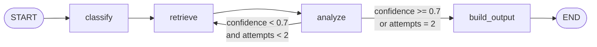

<div align="center">


# Ariadne

### Paste logs. Get a root-cause report. In seconds.

Stop reading stack traces during an incident.<br/>
Ariadne classifies the failure, retrieves similar past incidents, and hands you a structured report — root cause, confidence score, and next steps — so you can start fixing, not guessing.

<br/>

[**🚀 Live Demo**](https://ariadne-api.fly.dev/) &nbsp;·&nbsp; [**API Docs**](https://ariadne-api.fly.dev/docs) &nbsp;·&nbsp; [**Architecture**](docs/architecture.md)

<br/>

[](https://www.python.org/downloads/)
[](https://fastapi.tiangolo.com/)
[](https://langchain-ai.github.io/langgraph/)
[](LICENSE)

<br/>


</div>

---

## How it works

```
📋 Raw logs  ──►  🏷️ Classify failure  ──►  📚 Retrieve similar incidents  ──►  🧠 Root-cause report
```

Ariadne runs a **4-node [LangGraph](https://langchain-ai.github.io/langgraph/) pipeline** with a confidence-gated retry loop. If the first analysis pass scores below 0.7 confidence, it retrieves additional context and retries before returning.



| Node | What it does |
|---|---|
| **Classify** | LLM reads your logs → `incident_type` + `classification_confidence` |
| **Retrieve** | Embeds the query → Qdrant hybrid search → top-3 similar incident patterns |
| **Analyze** | LLM synthesizes logs + context → `root_cause`, `recommended_actions`, `analysis_confidence` |
| **Build output** | Merges results into a typed response; retries Retrieve→Analyze once if confidence < 0.7 |

---

## Example

**Input** — a PostgreSQL connection pool exhaustion incident:

```
2026-03-24T14:22:01Z checkout-api ERROR postgres-primary connection pool exhausted after 120 waiting clients
2026-03-24T14:22:02Z checkout-api WARN transaction failed because too many clients already
2026-03-24T14:22:03Z db-proxy ERROR postgres-primary refused new connection: remaining connection slots are reserved for non-replication superuser connections
2026-03-24T14:22:04Z checkout-api INFO application workers healthy but writes completely blocked
```

**Output:**

```json
{
  "incident_type": "database_issue",
  "root_cause": "The checkout service cannot acquire database connections because the PostgreSQL connection pool is exhausted. The db-proxy is refusing new connections and all application writes are blocked, indicating pool saturation likely driven by slow or long-running transactions holding slots.",
  "confidence": 0.91,
  "recommended_actions": [
    "Check pg_stat_activity for idle-in-transaction sessions holding pool slots — kill them if safe.",
    "Compare the current connection count against max_connections on the primary.",
    "Consider deploying PgBouncer in transaction-mode pooling to reduce per-connection overhead.",
    "Review whether a recent deploy changed query patterns or removed connection cleanup logic."
  ]
}
```

Ariadne supports incident responders, on-call engineers, and SREs who need a fast, structured starting point for triage. It does not execute remediations or replace the engineer's judgment — it speeds up the interpretation step.

---

## Architecture

| Layer | Path | Purpose |
|---|---|---|
| API | `ariadne/api/` | FastAPI wrapper — auth, rate limiting, CORS, Sentry |
| Pipeline | `ariadne/core/graph.py` | LangGraph `StateGraph` — 4 nodes, conditional retry routing |
| Classifier | `ariadne/core/agents/classifier.py` | LLM call → `incident_type` + `classification_confidence` |
| RAG retriever | `ariadne/core/agents/rag.py` | Embed query → Qdrant hybrid search → top-3 context docs |
| Ingestion pipeline | DVC pipeline (dvc.yaml) | Collect → preprocess → chunk → embed → index into Qdrant |
| Analyzer | `ariadne/core/agents/analyzer.py` | LLM call with context → `root_cause`, `recommended_actions`, `analysis_confidence` |
| LLM providers | `ariadne/core/integrations/llm/` | OpenAI, Ollama, Gemini — swappable via `LLM_PROVIDER` |
| Embeddings | `ariadne/core/integrations/embeddings/` | OpenAI, Ollama, Gemini, local hash — swappable |
| Vector store | `ariadne/core/retrieval/` | Qdrant (hybrid search) or NoOp fallback |
| Evals | `evals/` | Offline A/B prompt benchmark — 50 samples, rubric scoring |

Full diagram and ADR index → [docs/architecture.md](docs/architecture.md)

---

<details>
<summary><strong>Stack</strong></summary>

| Component | Technology | Why | Considered |
|---|---|---|---|
| Pipeline orchestration | LangGraph 0.2 | Declarative conditional edges, native LangSmith tracing, typed state | LangChain LCEL, custom Orchestrator (shipped Day 4, replaced Day 5 — see [ADR-001](docs/adr/ADR-001-langgraph.md)) |
| API framework | FastAPI 0.115 | Async, ASGI, automatic OpenAPI docs, slowapi rate limiting | Flask, Django REST |
| LLM (production) | Gemini 2.0 Flash | Permanent free tier (15 RPM, 1M TPD), reliable JSON generation | GPT-4o (no free tier), GPT-4o-mini (paid), Groq/Llama 3 — see [ADR-003](docs/adr/ADR-003-gemini.md) |
| LLM (evals/dev) | OpenAI GPT-4o-mini | Controlled cost in offline benchmarks | — |
| LLM (local dev) | Ollama llama3.1:8b | Zero cost, zero network, no API key | — |
| Vector store | Qdrant + Qdrant Cloud | Hybrid search built-in, same client locally and in cloud, free tier 1 GB | pgvector/Supabase (7d pause), FAISS (no hybrid), Pinecone — see [ADR-004](docs/adr/ADR-004-qdrant.md) |
| Embeddings (default local) | Ollama nomic-embed-text | Semantic quality, local, no API key | OpenAI text-embedding-3-small, Gemini text-embedding-004 |
| Backend hosting | Fly.io shared-cpu-1x | Scale-to-zero (~$0/month), Docker-native deploy, HTTPS automatic | AWS App Runner ($5+/mo), EC2 t2.micro (12-month limit), Render (30-90s cold start) — see [ADR-002](docs/adr/ADR-002-flyio.md) |
| Frontend hosting | Fly.io same-origin / Vercel | Next.js static export served from Docker image; Vercel optional for standalone | — |
| Observability | LangSmith | Per-run traces, token counts, per-node latency | LangFuse |
| Error tracking | Sentry | 5xx errors only, 10% trace sampling, free tier | — |

</details>

---

## Local development

### Prerequisites

| Requirement | Version | Notes |
|---|---|---|
| Python | 3.11+ | Required by `pyproject.toml` |
| Docker + Docker Compose | Any recent | Runs the local Qdrant instance |
| An LLM API key **or** Ollama | See below | Gemini (free) · OpenAI (paid) · Ollama (local, free) |

**Choosing a provider:**

| Option | What to set in `.env` | Cost | Requires |
|---|---|---|---|
| **Gemini** (recommended) | `LLM_PROVIDER=gemini`<br>`EMBEDDING_PROVIDER=gemini`<br>`GEMINI_API_KEY=<key>` | Free tier | Google AI Studio account |
| **Ollama** (fully local) | `LLM_PROVIDER=ollama`<br>`EMBEDDING_PROVIDER=ollama` | Free | Ollama running with `llama3.1:8b` + `nomic-embed-text:latest` |
| **OpenAI** | `LLM_PROVIDER=openai`<br>`EMBEDDING_PROVIDER=openai`<br>`OPENAI_API_KEY=<key>` | Paid | Funded OpenAI account |
| **No embeddings** | `EMBEDDING_PROVIDER=local_hash`<br>`VECTOR_STORE=none` | Free | Nothing — RAG disabled, lower quality |

### Setup

```bash
# 1. Clone
git clone https://github.com/YOUR_USER/ariadne.git
cd ariadne

# 2. Configure environment
cp .env.example .env
# Open .env and set LLM_PROVIDER + the corresponding API key (see table above)

# 3. Create virtual environment
python -m venv .venv
source .venv/bin/activate       # Windows: .venv\Scripts\activate

# 4. Install dependencies
pip install -r requirements.txt
pip install -e .

# 5. Start Qdrant (local vector store)
docker compose up -d

# 6. Index the knowledge base into Qdrant
# Post-mortems only (no GitHub token needed):
dvc repro

# Or full pipeline (GitHub issues + post-mortems):
export GITHUB_TOKEN=ghp_...
dvc repro collect_github
dvc repro

# 7. Start the API
uvicorn ariadne.api.main:app --reload --port 8000
```

### Verify it's working

```bash
# Liveness
curl http://localhost:8000/health
# → {"status": "ok"}

# Analyze an incident (API_KEY not set in dev → auth is disabled)
curl -X POST http://localhost:8000/analyze \
  -H 'Content-Type: application/json' \
  -d '{
    "logs": "ERROR postgres-primary connection pool exhausted after 120 waiting clients\nWARN transaction failed because too many clients already",
    "mode": "detailed"
  }'
```

Interactive API docs: `http://localhost:8000/docs`

### Re-indexing the knowledge base

See the [Ingestion pipeline](#ingestion-pipeline) section below for full DVC-based and legacy CLI instructions.

### Frontend (optional)

```bash
cd ui
cp .env.example .env.local
# Set NEXT_PUBLIC_API_URL=http://localhost:8000
npm install
npm run dev
# open http://localhost:3000
```

---

## Ingestion pipeline

The ingestion pipeline collects incident data (public post-mortems + GitHub bug issues), preprocesses and chunks the documents, embeds them, and indexes into Qdrant. It is managed with **[DVC](https://dvc.org)** so that stages only re-run when their inputs or parameters change — giving you reproducible, versioned data pipelines.

```
collect_postmortems ─┐
                     ├─► preprocess ─► chunk ─► index ─► evaluate
collect_github ──────┘
```

### DVC pipeline (recommended)

```bash
# Install DVC (once)
pip install dvc

# Run the full pipeline — postmortems only (no token needed)
dvc repro

# Check which stages are stale before running
dvc status

# Run with GitHub issues as well (requires GITHUB_TOKEN)
export GITHUB_TOKEN=ghp_...
dvc repro collect_github          # collect GitHub issues
dvc repro                         # run remaining stages

# Change a parameter and re-run only the affected stages
# Edit params.yaml, then:
dvc repro                         # DVC figures out what changed

# Force re-run all stages regardless of cache
dvc repro --force

# Run only the evaluation stage
dvc repro evaluate

# Compare metrics between the current run and the previous commit
dvc metrics diff

# Visualise metric history across git commits
dvc plots show data/pipeline/eval_report.json
```

**Pipeline parameters** — edit `params.yaml` to change defaults:

```yaml
ingest:
  max_postmortems: 800       # post-mortems to collect
  max_per_repo: 200          # GitHub issues per repo
  chunk_preset: medium       # small | medium | large | sentence
  embedding_batch_size: 32   # texts per embedding batch
```

**Pipeline outputs** tracked under `data/pipeline/`:

| File | Stage | Contents |
|---|---|---|
| `raw_postmortems.json` | collect_postmortems | Raw post-mortem documents |
| `raw_github.json` | collect_github | Raw GitHub issue documents |
| `clean_docs.json` | preprocess | Cleaned, deduplicated documents |
| `preprocess_report.json` | preprocess | Stats: input, output, rejection reasons |
| `chunks_medium.json` | chunk | Chunked documents (preset-named) |
| `eval_report.json` | evaluate | MRR, Recall@k per query |


## Running evaluations

The `evals/` directory contains an offline A/B benchmark that evaluates `detailed` vs `compact` prompt modes across 50 incident samples with rubric-based scoring.

```bash
# Full A/B benchmark (50 samples × 2 modes = 100 LLM calls)
python evals/run_ab_test.py

# List all 50 sample IDs
python evals/run_ab_test.py --list-samples

# Inspect a specific sample's rubric and expected output
python evals/run_ab_test.py --describe-sample database_pool_checkout

# Compare the two most recent benchmark runs
python evals/compare_results.py

# Provider benchmark with a subset (e.g. 10 samples)
python evals/run_provider_test.py -n 10
```

Results are saved to `evals/results/` as `latest.json` and a timestamped copy.

### What the metrics measure

| Metric | How it's computed |
|---|---|
| **Incident type accuracy** | Exact match between `incident_type` and `expected_incident_type` in the sample definition |
| **Root cause quality** | `0.85 × concept_coverage + 0.15 × uncertainty_score − 0.25 × forbidden_penalty`<br>Coverage = fraction of required keyword concepts present in the response |
| **Action quality** | `0.75 × concept_coverage + 0.25 × count_score − 0.15 × discouraged_penalty`<br>Count score = `min(action_count / minimum_required, 1.0)` |
| **Latency** | Wall-clock elapsed time for the full `run_graph()` call, including all LLM round-trips and retrieval |
| **Token usage** | `prompt_tokens`, `completion_tokens`, `total_tokens` summed across all LLM calls in the run |

The 50-sample library covers all five incident types (10 samples each): `timeout`, `dependency_failure`, `database_issue`, `memory_issue`, `unknown`. Unknown samples test both ambiguous cases (multiple plausible explanations) and out-of-taxonomy cases (clear root cause outside the Day 1 classification). Scoring implementation: [`evals/rubric_scoring.py`](evals/rubric_scoring.py).

> **Tip:** use `LLM_PROVIDER=openai` for bulk eval runs — it gives consistent results and won't exhaust the Gemini free-tier RPM limit mid-run.

---

## Deployment

The backend and UI are deployed as a single Docker image to [Fly.io](https://fly.io) (`shared-cpu-1x`, 512 MB, US East). The machine scales to zero when idle and resumes in ~2s on the first request.

```
Fly.io machine
└── Docker container (infra/Dockerfile — multi-stage build)
    ├── FastAPI API  (port 8080)
    └── Next.js static export  ← built at Docker build time, served by FastAPI StaticFiles
```

For technical details:
- [docs/adr/ADR-002-flyio.md](docs/adr/ADR-002-flyio.md) — why Fly.io over AWS
- `infra/Dockerfile` and `infra/fly.toml` — infrastructure as code

---

<details>
<summary><strong>API reference</strong></summary>

### `POST /analyze`

Run the incident analysis pipeline.

**Auth:** `X-API-Key: <your-key>` header. Set `API_KEY` in `.env`. If unset (dev mode), auth is disabled and a warning is logged at startup.  
**Rate limit:** 5 requests per minute per IP. Returns `429` with `Retry-After: 60` when exceeded.

**Request body:**

```json
{
  "logs": "raw log lines from the incident",
  "mode": "detailed"
}
```

`mode` is optional. Values: `"detailed"` (default) or `"compact"` (lower token cost).

**Example:**

```bash
curl -X POST https://ariadne-api-polished-shape-2678.fly.dev/analyze \
  -H 'Content-Type: application/json' \
  -H 'X-API-Key: your-api-key' \
  -d '{
    "logs": "2026-03-24T14:22:01Z checkout-api ERROR postgres-primary connection pool exhausted\n2026-03-24T14:22:02Z checkout-api WARN transaction failed because too many clients already",
    "mode": "detailed"
  }'
```

**Response `200`:**

```json
{
  "incident_type": "database_issue",
  "root_cause": "The checkout service cannot acquire new database connections because the PostgreSQL pool is exhausted...",
  "confidence": 0.91,
  "recommended_actions": [
    "Check pg_stat_activity for idle-in-transaction sessions holding pool slots.",
    "Compare the current connection count against max_connections.",
    "Consider deploying PgBouncer in transaction-mode pooling."
  ],
  "metadata": {
    "retrieval_attempts": 1,
    "llm_calls": 2,
    "node_timings": {
      "classify": 1.2,
      "retrieve_1": 0.08,
      "analyze": 2.9,
      "build_output": 0.001,
      "total": 4.19
    },
    "usage": {
      "prompt_tokens": 620,
      "completion_tokens": 112,
      "total_tokens": 732
    }
  }
}
```

**`incident_type` values:** `timeout` · `dependency_failure` · `database_issue` · `memory_issue` · `unknown`

**Error responses:**

| Code | Meaning |
|---|---|
| `401` | Missing or invalid `X-API-Key` header |
| `422` | Malformed request body |
| `429` | Rate limit exceeded (5 req/min/IP) |
| `500` | Pipeline error |

---

### `GET /health`

Liveness check. No auth required. Used by Fly.io health checks (every 30s).

```bash
curl https://ariadne-api-polished-shape-2678.fly.dev/health
# → {"status": "ok"}
```

---

### `GET /ready`

Readiness check. No auth required.

```bash
curl https://ariadne-api-polished-shape-2678.fly.dev/ready
# → {"status": "ready"}
```

</details>

---

<details>
<summary><strong>Roadmap</strong></summary>

These items were deliberately deferred to keep the project shipping rather than building:

1. **Groq / Llama 3 provider** — A `GroqClient` implementation would give a second permanent free-tier LLM with different quality/speed characteristics. The provider-agnostic interface makes this a ~50-line addition.

2. **Streaming response for `POST /analyze`** — The API currently returns the full result after the entire pipeline finishes (~3–6s). Server-sent events (SSE) would allow the UI to show partial results as each node completes, improving perceived latency significantly.

3. **Ingestion pipeline improvements** — The current DVC pipeline collects from GitHub issues and public post-mortems, with checkpointing and retrieval evaluation. A `POST /admin/reindex` endpoint would make re-indexing self-service without CLI access.

4. **Metadata filters in retrieval** — The Qdrant query currently uses only dense + BM25 similarity. Filtering by `incident_type` (from the classifier output) before retrieval runs would improve precision for the known taxonomy.

5. **Confidence calibration** — The current `confidence` score is self-reported by the LLM and not calibrated against ground-truth outcomes. A Platt scaling pass over eval results would make the score meaningful as a triage signal.

</details>

---

<details>
<summary><strong>Contributing</strong></summary>

```bash
# Run unit tests (no external services required)
pytest tests/unit/

# Run integration tests (API must be running on :8000)
pytest tests/integration/

# Run the full offline benchmark
python evals/run_ab_test.py
```

Keep PRs focused — don't mix feature additions with refactors. If you're adding a new LLM provider, follow the existing pattern in `ariadne/core/integrations/llm/`: implement `LLMClient`, wire it in `config.py`, add unit tests.

</details>

---

## License

MIT — see [LICENSE](LICENSE).
