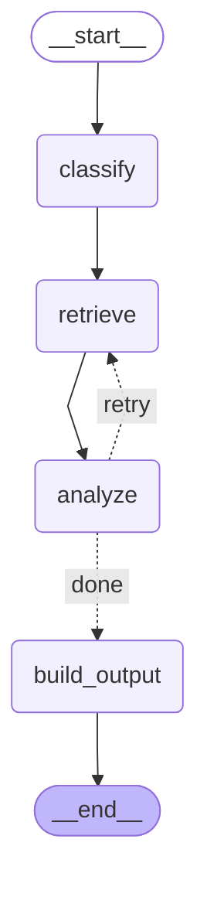

# Day 4: Multi-Agent Design and Orchestration

## What changed

- Extracted a central **`IncidentState`** (Pydantic model) that flows through every agent and carries the full execution trace.
- Wrapped each pipeline stage in an **agent class** (`ClassifierAgent`, `RAGAgent`, `AnalyzerAgent`) behind a shared `BaseAgent` interface.
- Created an **`Orchestrator`** that owns all execution decisions: sequencing, conditional re-runs, and final output assembly.
- Added **conditional logic**: when analysis confidence is below 0.7 the orchestrator re-runs retrieval with an enriched query and re-runs the analyzer — capped at one retry to prevent loops.
- Promoted the orchestrator to the single public runtime entrypoint via `orchestrator.analyze_incident(...)` and `orchestrator.build_output(...)`.

## Why agents improve modularity

Each agent encapsulates a single responsibility — classification, retrieval, or analysis — behind an identical interface (`run(state) → state`).  This means:

- Agents can be tested, replaced, or versioned independently.
- A new agent (e.g., a `SummaryAgent` or `TriageAgent`) can be added without modifying existing agents.
- Prompt engineering, model selection, and validation logic stay local to the agent that owns them.

The agents **never call each other**.  All coordination flows through the orchestrator, so there are no hidden dependencies between agents.

## Why state is centralized

A shared `IncidentState` object makes data flow explicit:

- Every field written by an agent is visible to any later step — no hidden side channels.
- The orchestrator can inspect intermediate results (e.g., `analysis.confidence`) to make control-flow decisions.
- Logging and debugging are straightforward: dump the state at any point to see the full picture.
- Serialising the state gives a complete execution trace for audit or replay.

The alternative — passing ad-hoc arguments between agents — quickly becomes tangled as the number of agents grows.

## Why orchestration is needed

Without an orchestrator each agent would need to know "who comes next" and "what to do when something goes wrong".  This scatters execution logic across agents and makes the overall flow hard to reason about.

The orchestrator centralises:

- **Sequencing** — which agent runs in what order.
- **Conditional branching** — re-run retrieval and analysis when confidence is low.
- **Retry budgets** — cap re-runs to avoid infinite loops.
- **Output assembly** — merge classification and analysis into the final report.

This separation means agents stay focused on their domain while the orchestrator handles workflow concerns.

## Conditional re-run design

When the first analysis pass yields `confidence < 0.7`:

1. The orchestrator logs the decision with the actual confidence value.
2. It re-runs the `RAGAgent` with an **enriched query** — the original logs plus the predicted incident type and the first root-cause hypothesis — so the vector search targets more relevant documents.
3. It re-runs the `AnalyzerAgent` with the updated context.
4. At most **one retry** is allowed (`MAX_RETRIES = 1`).  If confidence is still low after the retry the orchestrator accepts the result rather than looping.

## Limitations of this approach

### Linear, hard-coded flow
The orchestrator encodes a fixed sequence. Adding parallel agent execution, dynamic routing, or complex branching requires rewriting control-flow logic. A graph-based orchestrator (the topic for a future day) addresses this.

### Shared mutable state
Agents mutate the same `IncidentState` object.  This is simple and readable, but it means the orchestrator must enforce ordering — agents cannot safely run in parallel without cloning or locking the state.

### No memory across invocations
State is created fresh for every incident.  There is no cross-incident learning, session history, or feedback loop.

### Retry heuristic is coarse
Re-running the same agents with a slightly enriched query is a blunt instrument.  A production system might switch models, adjust temperature, expand the search window, or escalate to a human reviewer.

### No agent-level error isolation
If an agent raises an unhandled exception the entire orchestrator run fails.  Production systems typically wrap each agent call in a try/except with graceful degradation at the orchestration boundary.

---

## Day 5 update: LangGraph migration

The manual `Orchestrator` class has been replaced by a LangGraph `StateGraph`.

### What changed

- `src/graph.py` — defines the graph: nodes, edges, and conditional retry routing.
- `src/orchestrator.py` — now a thin shim; `analyze_incident()` delegates to `run_graph()`.
- Agent classes (`ClassifierAgent`, `RAGAgent`, `AnalyzerAgent`) removed; each is now a plain function (`run_classifier`, `run_retrieval`, `run_analyzer`).
- `BaseAgent` ABC removed — superseded by direct function calls from graph nodes.
- `build_output()` moved from `orchestrator.py` to `models.py` (pure data assembly, not orchestration).

### Graph flow

```
START → classify → retrieve → analyze → should_retry?
                                          ├─ "retry"  (confidence < 0.7 and attempts < 2) → retrieve
                                          └─ "done"                                        → build_output → END
```

### Mermaid diagram

Generated via `get_graph_diagram()` from `src/graph.py`:



### Why this is better

| Concern | Manual orchestrator | LangGraph graph |
|---------|--------------------|--------------------|
| Flow definition | Imperative `if/else` + `while` in `run()` | Declarative nodes + edges |
| Adding a step | Edit `run()` method | Add node + wire edge |
| Retry logic | Interleaved with agent calls | Isolated in `should_retry()` |
| Visualization | Read the source | `get_graph_diagram()` |
| Testability | Mock agent classes | Mock plain functions |

### Tradeoffs

- LangGraph adds a dependency and a small learning curve.
- For a three-step pipeline the imperative version is equally readable; the graph pays off as the pipeline grows.
