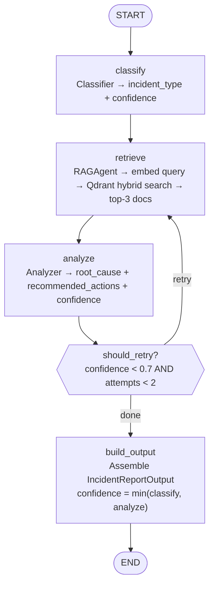

# Ariadne — Architecture Reference

Companion to the README. Collects the pipeline diagram, layer descriptions, and links to the Architecture Decision Records.

---

## Pipeline graph

Defined in [`ariadne/core/graph.py`](../ariadne/core/graph.py).



### Node descriptions

| Node | File | What it does |
|---|---|---|
| `classify` | `ariadne/core/agents/classifier.py` | LLM call: maps logs to one of 5 incident types, emits `classification_confidence` |
| `retrieve` | `ariadne/core/agents/rag.py` | Embeds query, runs Qdrant hybrid search (dense 0.65 + keyword 0.35), returns top-3 context docs |
| `analyze` | `ariadne/core/agents/analyzer.py` | LLM call: uses logs + context to produce `root_cause`, `recommended_actions`, `analysis_confidence` |
| `should_retry` | `ariadne/core/graph.py` | Conditional edge: routes back to `retrieve` if `confidence < 0.7` and `retrieval_attempts < 2` |
| `build_output` | `ariadne/core/graph.py` | Assembles `IncidentReportOutput`; final confidence = `min(classification_confidence, analysis_confidence)` |

---

## Shared state

All nodes read and write a single [`IncidentState`](../ariadne/core/state.py) (Pydantic model):

| Field | Written by | Purpose |
|---|---|---|
| `logs` | caller | Raw log text — input |
| `mode` | caller | `"detailed"` or `"compact"` prompt mode |
| `incident_type` | classify | One of 5 taxonomy values |
| `classification_confidence` | classify | float 0–1 |
| `context` | retrieve | list of retrieved document snippets |
| `analysis` | analyze | `AnalysisOutput` (root_cause, actions, confidence) |
| `final_output` | build_output | `IncidentReportOutput` — API response payload |
| `retrieval_attempts` | retrieve | incremented on each retrieval pass |
| `total_prompt_tokens` | classify, analyze | accumulated across all LLM calls |
| `total_completion_tokens` | classify, analyze | accumulated across all LLM calls |
| `total_llm_calls` | classify, analyze | count |
| `node_timings` | every node | dict of per-node wall-clock seconds |

---

## System layers

```
┌────────────────────────────────────────────────────────────────┐
│  Next.js UI  (Vercel static export or Fly.io same-origin)      │
│  LogInput → POST /analyze → AnalysisResult                     │
└──────────────────────────┬─────────────────────────────────────┘
                           │ HTTPS  X-API-Key header
┌──────────────────────────▼─────────────────────────────────────┐
│  FastAPI  (ariadne/api/)                                       │
│  Auth: hmac.compare_digest  Rate limit: 5 req/min/IP           │
│  CORS: ALLOWED_ORIGINS      Error tracking: Sentry (5xx only)  │
└──────────────────────────┬─────────────────────────────────────┘
                           │
┌──────────────────────────▼─────────────────────────────────────┐
│  LangGraph pipeline  (ariadne/core/graph.py)                   │
│  classify → retrieve → analyze → [retry?] → build_output       │
└──────────┬──────────────────────┬──────────────────────────────┘
           │                      │
┌──────────▼──────────┐  ┌────────▼───────────────────────────┐
│  LLM provider       │  │  Vector store                       │
│  Gemini 2.0 Flash   │  │  Qdrant Cloud  (production)         │
│  (default)          │  │  Qdrant Docker (local dev)          │
│  OpenAI / Ollama    │  │  Hybrid: dense 0.65 + keyword 0.35  │
│  also supported     │  └─────────────────────────────────────┘
└─────────────────────┘
```

---

## Production deployment

| Component | Platform | Notes |
|---|---|---|
| API + UI | Fly.io `shared-cpu-1x` 512 MB | Scale-to-zero, US East (iad) |
| Vector store | Qdrant Cloud free tier | 1 GB, same client as local Docker |
| LLM | Google Gemini API (free tier) | 15 RPM, 1M tokens/day |
| Frontend (standalone) | Vercel (optional) | Same-origin with Fly.io by default |
| Error tracking | Sentry free tier | 5xx only, 10% trace sampling |
| Observability | LangSmith free tier | Per-run traces, token counts |

---

## Architecture Decision Records

| ADR | Decision |
|---|---|
| [ADR-001](adr/ADR-001-langgraph.md) | LangGraph over custom Orchestrator / LCEL |
| [ADR-002](adr/ADR-002-flyio.md) | Fly.io over AWS for backend hosting |
| [ADR-003](adr/ADR-003-gemini.md) | Gemini Flash as primary production LLM |
| [ADR-004](adr/ADR-004-qdrant.md) | Qdrant Cloud over pgvector / FAISS / Pinecone |
